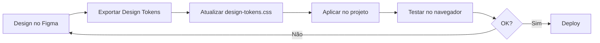

# 🎨 Guia de Integração Figma + Sebrae AI Assistant

## 📋 Opções de Integração

### 🚀 Opção 1: Design Tokens (Recomendado)

**Melhor para:** Manter consistência de design e facilitar atualizações

#### Passos:

1. **No Figma:**

   - Abra seu design do Sebrae AI Assistant
   - Vá em `Plugins` → `Design Tokens` ou `Style Dictionary`
   - Configure suas cores, tipografia, espaçamentos
   - Exporte como CSS Variables

2. **No Projeto:**

   - Use o arquivo `frontend/design-tokens.css` que criei
   - Atualize as variáveis com os valores do Figma
   - Importe no seu HTML:

   ```html
   <link
     rel="stylesheet"
     href="design-tokens.css"
   />
   ```

3. **Usar as variáveis:**
   ```css
   .button-primary {
     background-color: var(--primary-color);
     padding: var(--spacing-md);
     border-radius: var(--radius-md);
   }
   ```

---

### 🎯 Opção 2: Plugins de Export (Mais Rápido)

**Melhor para:** Converter design diretamente em código

#### Plugins Recomendados:

##### 1. **Figma to Code** (Grátis)

```
1. Instalar: Figma → Plugins → Browse → "Figma to Code"
2. Selecionar elementos no Figma
3. Copiar código HTML/CSS gerado
4. Colar em frontend/index.html
```

##### 2. **Anima** (Freemium)

- Exporta para React, Vue, HTML
- Mantém animações e interações
- URL: https://www.animaapp.com/

##### 3. **TeleportHQ** (Grátis)

- Converte Figma → HTML/CSS/React
- Código limpo e semântico
- URL: https://teleporthq.io/

##### 4. **Locofy** (Recomendado)

- IA para converter design em código
- Muito preciso para React/HTML
- URL: https://www.locofy.ai/

---

### 🔧 Opção 3: API do Figma

**Melhor para:** Sincronização automática e CI/CD

#### Setup:

```javascript
// figma-sync.js
const FIGMA_TOKEN = "seu-token-aqui";
const FILE_KEY = "seu-file-key";

async function exportFromFigma() {
  const response = await fetch(`https://api.figma.com/v1/files/${FILE_KEY}`, {
    headers: {"X-Figma-Token": FIGMA_TOKEN},
  });

  const data = await response.json();
  // Processar e gerar CSS/HTML
}
```

**Como obter token:**

1. Figma → Settings → Personal Access Tokens
2. Create new token
3. Copiar e usar no script

---

## 🎨 Workflow Recomendado

### Para o Sebrae AI Assistant:



### Passo a Passo Prático:

#### 1️⃣ **Preparar Figma**

```
• Crie/abra design do Sebrae AI Assistant
• Organize em Components e Variants
• Defina Design System (cores, fontes, espaçamentos)
• Use Auto Layout para responsividade
```

#### 2️⃣ **Exportar Assets**

```
• Imagens: Export → PNG/SVG → Salvar em frontend/img/
• Ícones: Export → SVG → Salvar em frontend/icons/
• Logos: Export → SVG/PNG → Salvar em frontend/img/
```

#### 3️⃣ **Gerar Código**

**Opção A - Manual:**

```
1. Inspecionar elemento no Figma
2. Copiar propriedades CSS do painel direito
3. Aplicar no styles.css
```

**Opção B - Plugin:**

```
1. Selecionar tela/componente no Figma
2. Plugins → Figma to Code
3. Copiar código gerado
4. Colar em index.html/styles.css
```

#### 4️⃣ **Aplicar Design Tokens**

```css
/* Antes */
.button {
  background: #006ec7;
  padding: 16px;
  border-radius: 8px;
}

/* Depois (usando tokens) */
.button {
  background: var(--primary-color);
  padding: var(--spacing-md);
  border-radius: var(--radius-md);
}
```

#### 5️⃣ **Testar Responsividade**

```
• Chrome DevTools → Toggle device toolbar
• Testar breakpoints: mobile, tablet, desktop
• Ajustar se necessário
```

---

## 📦 Ferramentas Úteis

### Plugins Figma Essenciais:

1. **Figma to Code** - Converte design em código
2. **Iconify** - Biblioteca de ícones
3. **Content Reel** - Conteúdo de exemplo
4. **Unsplash** - Imagens stock
5. **Auto Layout** - Layouts responsivos
6. **Master** - Componentes prontos

### Extensões Chrome:

1. **Figma Inspector** - Inspecionar valores CSS
2. **PerfectPixel** - Comparar design com implementação
3. **WhatFont** - Identificar fontes

---

## 🎯 Exemplo Prático: Redesign do Chat

### 1. **No Figma:**

Crie este componente de mensagem:

```
Frame: message-container
├── Avatar (40x40, rounded-full)
├── Content
│   ├── Header (flex)
│   │   ├── Name (text-bold)
│   │   └── Time (text-sm, text-gray-500)
│   └── Message (text-base)
└── Actions (icons)
```

### 2. **Exportar HTML/CSS:**

```html
<!-- Código gerado pelo plugin -->
<div class="message-container">
  
  <div class="content">
    <div class="header">
      <span class="name">Consultor IA Sebrae</span>
      <span class="time">10:30</span>
    </div>
    <p class="message">Olá! Como posso ajudar?</p>
  </div>
</div>
```

### 3. **Aplicar Design Tokens:**

```css
.message-container {
  display: flex;
  gap: var(--spacing-md);
  padding: var(--spacing-lg);
  background: var(--gray-50);
  border-radius: var(--radius-lg);
  box-shadow: var(--shadow-sm);
}

.avatar {
  width: 40px;
  height: 40px;
  border-radius: var(--radius-full);
}

.name {
  color: var(--primary-color);
  font-weight: var(--font-weight-semibold);
}

.time {
  color: var(--gray-500);
  font-size: var(--text-sm);
}
```

---

## 📊 Comparação de Métodos

| Método         | Velocidade | Precisão   | Manutenção | Complexidade |
| -------------- | ---------- | ---------- | ---------- | ------------ |
| Design Tokens  | ⭐⭐⭐     | ⭐⭐⭐⭐⭐ | ⭐⭐⭐⭐⭐ | ⭐⭐         |
| Plugins Export | ⭐⭐⭐⭐⭐ | ⭐⭐⭐⭐   | ⭐⭐⭐     | ⭐           |
| API Figma      | ⭐⭐       | ⭐⭐⭐⭐⭐ | ⭐⭐⭐⭐⭐ | ⭐⭐⭐⭐⭐   |
| Manual         | ⭐         | ⭐⭐⭐⭐⭐ | ⭐⭐       | ⭐⭐⭐       |

---

## 🚀 Quick Start

### Para começar AGORA:

1. **Criar conta no Figma** (se não tiver)

   - https://www.figma.com/signup

2. **Usar template gratuito**

   - Procurar "Dashboard Template" ou "Admin Panel"
   - Duplicar para seu workspace
   - Customizar com identidade Sebrae

3. **Instalar plugin "Figma to Code"**

   - Figma → Plugins → Browse all plugins
   - Buscar "Figma to Code"
   - Install

4. **Exportar e aplicar**
   - Selecionar componente
   - Plugin → Figma to Code → Copy
   - Colar no seu projeto

---

## 💡 Dicas Profissionais

### ✅ Boas Práticas:

- Use **Auto Layout** no Figma para flexbox automático
- Nomeie layers com classes CSS: `.button-primary`
- Agrupe elementos relacionados em **Components**
- Crie **Variants** para estados (hover, active, disabled)
- Use **Constraints** para responsividade

### ⚠️ Evite:

- Valores absolutos (px) - prefira rem/em
- Cores hardcoded - use variáveis
- Componentes sem organização
- Ignorar breakpoints mobile

---

## 📚 Recursos Adicionais

### Tutoriais:

- [Figma to Code (YouTube)](https://www.youtube.com/results?search_query=figma+to+html+css)
- [Design Tokens](https://www.youtube.com/results?search_query=design+tokens+figma)
- [Figma API Docs](https://www.figma.com/developers/api)

### Templates Figma Gratuitos:

- [Figma Community - Dashboards](https://www.figma.com/community/search?model_type=files&q=dashboard)
- [Sebrae Design System](https://www.figma.com/community/search?q=sebrae)

### Ferramentas Online:

- [Figma to HTML](https://www.figma.com/community/plugin/1159123024924461424)
- [Design Tokens Generator](https://www.figma.com/community/plugin/888356646278934516)

---

## 🎯 Próximos Passos

1. ✅ Use o arquivo `design-tokens.css` criado
2. ⚡ Instale plugin "Figma to Code"
3. 🎨 Crie/adapte design no Figma
4. 📤 Exporte e aplique no projeto
5. 🧪 Teste e ajuste

**Resultado:** Interface moderna, consistente e fácil de manter! 🚀
