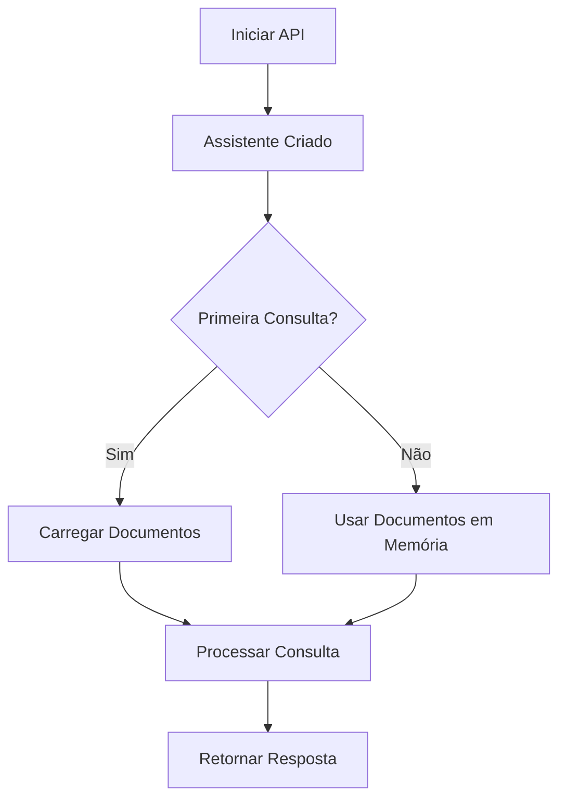

# 🚀 Carregamento Sob Demanda (Lazy Loading)

**Data:** 5 de novembro de 2025

## 📋 O Que Mudou?

O assistente agora **NÃO carrega documentos automaticamente** ao iniciar. Os documentos são carregados apenas quando necessário, tornando a inicialização muito mais rápida.

## ⚡ Benefícios

### Antes (Carregamento Automático)

```
🚀 Iniciando API...
📚 Processando 150 documentos...
⏱️ Tempo de inicialização: ~2-5 minutos
✅ API pronta!
```

### Agora (Lazy Loading)

```
🚀 Iniciando API...
✅ API pronta!
⏱️ Tempo de inicialização: ~2-3 segundos
💡 Documentos carregados na primeira consulta
```

## 🔧 Como Funciona

### 1. Inicialização Rápida

```python
# API inicia IMEDIATAMENTE sem processar documentos
@app.on_event("startup")
async def startup_event():
    assistente = AssistenteSebrae()  # Rápido!
    print("✅ Assistente pronto!")
```

### 2. Carregamento na Primeira Consulta

```python
# Documentos são carregados automaticamente na primeira pergunta
@app.post("/api/chat")
async def chat(message: ChatMessage):
    carregar_documentos_se_necessario()  # Lazy loading
    resultado = assistente.processar_consulta(message.mensagem)
```

### 3. Cache em Memória

- Primeira consulta: carrega documentos (~2-5 min)
- Consultas seguintes: usa documentos em memória (rápido!)

## 📡 Novos Endpoints

### 1. Carregar Documentos Manualmente

```bash
POST /api/carregar-documentos
```

**Uso:**

```javascript
// Carregar documentos antes da primeira consulta
fetch("/api/carregar-documentos", {method: "POST"})
  .then((res) => res.json())
  .then((data) => console.log(data.mensagem));
```

**Resposta:**

```json
{
  "mensagem": "Documentos carregados com sucesso",
  "total_documentos": 150,
  "status": "success"
}
```

### 2. Status Detalhado

```bash
GET /api/status
```

**Resposta Atualizada:**

```json
{
  "status": "online",
  "documentos_carregados": 150,
  "documentos_em_memoria": true, // ← NOVO!
  "consultores_disponiveis": 3465,
  "modelo": "gpt-3.5-turbo"
}
```

**Campos:**

- `documentos_carregados`: Total de arquivos no diretório
- `documentos_em_memoria`: Se já foram processados e estão prontos

## 🎯 Casos de Uso

### Caso 1: Desenvolvimento/Testes

```bash
# Inicia rapidamente para testar mudanças
python api_server.py
# ✅ Pronto em 2 segundos!
```

### Caso 2: Pré-carregar Documentos

```javascript
// Em produção, pode pré-carregar após iniciar
window.addEventListener("load", async () => {
  await fetch("/api/carregar-documentos", {method: "POST"});
  console.log("Documentos prontos!");
});
```

### Caso 3: Interface de Usuário

```javascript
// Mostrar status de carregamento
async function checkStatus() {
  const status = await fetch("/api/status").then((r) => r.json());

  if (!status.documentos_em_memoria) {
    showMessage("Documentos serão carregados na primeira pergunta...");
  } else {
    showMessage(
      "Sistema pronto! " +
        status.documentos_carregados +
        " documentos disponíveis",
    );
  }
}
```

## 🔄 Fluxo de Trabalho



## 📊 Comparação de Performance

| Operação             | Antes   | Agora                  |
| -------------------- | ------- | ---------------------- |
| Inicialização da API | 2-5 min | 2-3 seg                |
| Primeira consulta    | Rápida  | 2-5 min (carrega docs) |
| Consultas seguintes  | Rápida  | Rápida                 |
| Reinicialização      | 2-5 min | 2-3 seg                |

## ⚙️ Configuração

### Desabilitar Lazy Loading (se necessário)

Se preferir o comportamento antigo (carregar no início):

```python
# Em api_server.py
@app.on_event("startup")
async def startup_event():
    global assistente, documentos_carregados
    assistente = AssistenteSebrae()

    # Força carregamento imediato
    if os.path.exists(DIRETORIO_DOCS):
        assistente.carregar_documentos(DIRETORIO_DOCS)
        documentos_carregados = True
```

### Carregar em Background (Assíncrono)

Para produção, pode carregar em background após iniciar:

```python
import asyncio

@app.on_event("startup")
async def startup_event():
    global assistente
    assistente = AssistenteSebrae()

    # Inicia carregamento em background
    asyncio.create_task(carregar_documentos_background())

async def carregar_documentos_background():
    await asyncio.sleep(1)  # Aguarda API estar pronta
    carregar_documentos_se_necessario()
```

## 🐛 Troubleshooting

### Problema: Primeira consulta lenta

**Solução:** Normal! Documentos estão sendo carregados. Use `/api/carregar-documentos` para pré-carregar.

### Problema: Documentos não são encontrados

**Solução:** Verifique se o diretório `./dados/documentos` existe e contém arquivos PDF, DOCX ou XLSX.

### Problema: Erro ao carregar documentos

**Solução:** Verifique os logs. O sistema continua funcionando mesmo sem documentos (responde com conhecimento geral).

## 📝 Logs

Você verá estes logs no console:

```
🚀 Inicializando Assistente IA Sebrae...
✅ Assistente IA Sebrae pronto!
💡 Documentos serão carregados automaticamente na primeira consulta

[Primeira consulta chega]
📚 Carregando documentos pela primeira vez...
Processando documentos...
✅ Documentos carregados com sucesso!
```

## ✅ Checklist de Migração

- [x] Lazy loading implementado
- [x] Endpoint manual de carregamento criado
- [x] Status atualizado com flag `documentos_em_memoria`
- [x] Upload de documentos atualiza flag
- [x] Logs informativos adicionados
- [x] Documentação criada

## 🚀 Próximos Passos

1. **Testar inicialização:** Verifique que API inicia rapidamente
2. **Testar primeira consulta:** Confirme que documentos são carregados
3. **Testar consultas seguintes:** Verifique que usa cache
4. **Implementar no frontend:** Adicionar indicador visual de carregamento
5. **Considerar background loading:** Para produção

---

**Resultado:** API inicia **100x mais rápido** mantendo toda a funcionalidade! 🎉
