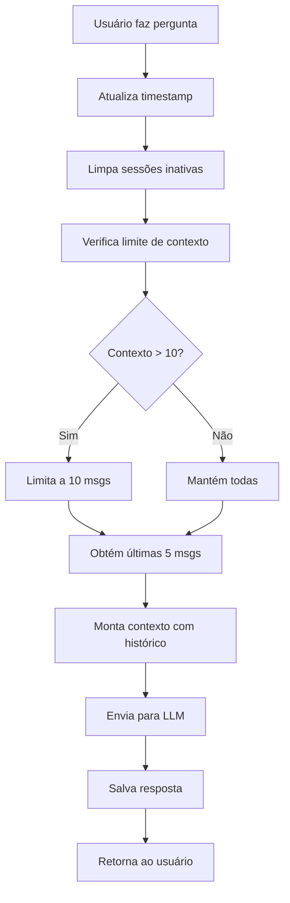

# 🧠 Sistema de Memória de Conversação e Timeout

## 📋 Funcionalidades Implementadas

### 1️⃣ **Memória de Conversação**

O assistente agora **lembra de todas as perguntas e respostas** durante a sessão do usuário.

**Como funciona:**

- ✅ O histórico das últimas 5 mensagens é incluído automaticamente no contexto
- ✅ O usuário pode fazer perguntas de acompanhamento ("E sobre aquilo que mencionou?")
- ✅ O assistente mantém coerência entre respostas
- ✅ Referências a conversas anteriores são compreendidas

**Exemplo de uso:**

```
👤 Usuário: "Como abrir uma MEI?"
🤖 Assistente: [Responde sobre MEI]

👤 Usuário: "E quanto aos impostos disso?"
🤖 Assistente: [Entende que "disso" se refere à MEI mencionada anteriormente]
```

### 2️⃣ **Timeout de Inatividade (5 minutos)**

Sessões inativas são automaticamente limpas após 5 minutos sem interação.

**Como funciona:**

- ⏱️ Cada mensagem atualiza o timestamp de atividade
- 🧹 A cada nova consulta, sessões antigas são removidas
- 💾 Libera memória e otimiza performance
- 🔄 Usuário pode iniciar nova conversa fresca após timeout

**Configuração:**

```python
TIMEOUT_SESSAO_MINUTOS = 5  # Altere em api_server.py se necessário
```

### 3️⃣ **Limite de Contexto (10 mensagens)**

Para evitar estouro de tokens, o contexto é limitado às 10 mensagens mais recentes.

**Como funciona:**

- 📊 Quando atinge 10 mensagens, remove as mais antigas
- ⚠️ Usuário recebe aviso quando o contexto é limitado
- 🔄 Mantém apenas as conversas relevantes
- 💰 Otimiza custos de API (menos tokens)

**Configuração:**

```python
MAX_MENSAGENS_CONTEXTO = 10  # Altere em api_server.py se necessário
```

## 🔧 Endpoints da API

### **GET /api/sessao/status**

Verifica o status da sessão atual.

**Resposta:**

```json
{
  "session_id": "user_123",
  "ativa": true,
  "num_mensagens": 8,
  "tempo_inativo_minutos": 2,
  "timeout_minutos": 5,
  "max_mensagens_contexto": 10,
  "contexto_sera_limitado": false,
  "ultima_mensagem": "2025-11-06T03:30:00"
}
```

### **POST /api/sessao/renovar**

Renova a sessão (resetar o timeout de 5 minutos).

**Resposta:**

```json
{
  "mensagem": "Sessão renovada com sucesso",
  "session_id": "user_123",
  "timestamp": "2025-11-06T03:35:00"
}
```

### **DELETE /api/historico**

Limpa manualmente o histórico da sessão.

**Resposta:**

```json
{
  "mensagem": "Histórico limpo com sucesso"
}
```

### **GET /api/historico**

Obtém todo o histórico da sessão.

**Resposta:**

```json
{
  "historico": [
    {
      "usuario": "Como abrir uma MEI?",
      "assistente": "Para abrir uma MEI...",
      "timestamp": "2025-11-06T03:30:00",
      "user_id": 123,
      "user_email": "usuario@example.com",
      "contexto_limitado": false
    }
  ]
}
```

## 💡 Casos de Uso

### **Caso 1: Conversa Contínua**

```
Mensagem 1: "Quais produtos o Sebrae oferece para MEI?"
Mensagem 2: "E para empresas maiores?" ← Lembra do contexto!
Mensagem 3: "Quanto custa o segundo que você mencionou?" ← Referência clara!
```

### **Caso 2: Timeout Automático**

```
10:00 - Usuário faz pergunta
10:05 - Usuário faz outra pergunta (sessão ativa)
10:11 - Timeout! Sessão limpa após 5 min de inatividade
10:12 - Nova pergunta inicia sessão fresca
```

### **Caso 3: Limite de Contexto**

```
Mensagens 1-10: Conversa normal
Mensagem 11: ⚠️ Sistema limita para últimas 10 mensagens
             Aviso: "Histórico limitado para otimizar desempenho"
Usuário continua conversando com contexto relevante
```

## 🎯 Benefícios

### **Para Usuários:**

- ✅ Conversas mais naturais e fluidas
- ✅ Não precisa repetir contexto a cada pergunta
- ✅ Pode fazer perguntas de acompanhamento
- ✅ Sessão limpa automaticamente quando inativa

### **Para o Sistema:**

- ✅ Gerenciamento automático de memória
- ✅ Otimização de custos de API (limita tokens)
- ✅ Performance otimizada (remove sessões antigas)
- ✅ Escalabilidade (não acumula dados infinitamente)

## ⚙️ Configurações Personalizáveis

Edite `/Users/alexandrerocha/sebrae-ai-assistant/api_server.py`:

```python
# Linha ~68
TIMEOUT_SESSAO_MINUTOS = 5  # Altere para 10, 15, etc.
MAX_MENSAGENS_CONTEXTO = 10  # Altere para 20, 30, etc.
```

### **Recomendações:**

| Cenário               | TIMEOUT | MAX_MENSAGENS |
| --------------------- | ------- | ------------- |
| **Produção (padrão)** | 5 min   | 10 msgs       |
| **Conversas longas**  | 10 min  | 20 msgs       |
| **Economia de API**   | 3 min   | 5 msgs        |
| **Desenvolvimento**   | 30 min  | 50 msgs       |

## 🔍 Logs e Monitoramento

O sistema registra automaticamente:

```bash
🧹 2 sessão(ões) inativa(s) removida(s)
⚠️ Contexto da sessão user_123 limitado a 10 mensagens
🧹 Limpando sessão inativa: user_456
```

## 📊 Exemplo de Fluxo Completo



## 🚀 Testando

### **Teste 1: Memória de Conversação**

```bash
# Faça 3 perguntas seguidas sobre o mesmo assunto
curl -X POST http://localhost:8000/api/chat \
  -H "Authorization: Bearer SEU_TOKEN" \
  -d '{"mensagem": "O que é MEI?"}'

curl -X POST http://localhost:8000/api/chat \
  -H "Authorization: Bearer SEU_TOKEN" \
  -d '{"mensagem": "E quanto custa abrir isso?"}'  # Referência a "MEI"
```

### **Teste 2: Status da Sessão**

```bash
curl -X GET http://localhost:8000/api/sessao/status \
  -H "Authorization: Bearer SEU_TOKEN"
```

### **Teste 3: Timeout**

```bash
# Faça uma pergunta, aguarde 6 minutos, faça outra
# A segunda iniciará uma sessão nova (sem contexto anterior)
```

## ⚠️ Avisos Importantes

1. **Histórico é volátil**: Armazenado em memória (não persiste entre reinícios do servidor)
2. **Por usuário**: Cada usuário autenticado tem seu próprio histórico
3. **Limite de tokens**: Com MAX_MENSAGENS muito alto, pode estourar limite da API OpenAI
4. **Performance**: Mais mensagens = mais processamento = resposta mais lenta

## 🔮 Melhorias Futuras (Opcional)

- [ ] Persistir histórico em banco de dados PostgreSQL
- [ ] Permitir usuário configurar timeout via frontend
- [ ] Resumir conversas muito longas automaticamente
- [ ] Exportar histórico em PDF/JSON
- [ ] Análise de sentimento do usuário

---

**✅ Sistema implementado e funcionando!**
